# PES-VCS Lab Report

## **Name: Dharani S**
## **srn: PES2UG24CS157**
## [Repository](https://github.com/Dharani9018/PES2UG24CS157-pes-vcs)
---

## Phase 1: Object Storage Foundation

**Filesystem Concepts:** Content-addressable storage, directory sharding, atomic writes, hashing for integrity

### Implementation Summary

**`object_write`** builds a full object by prepending a type header (`"blob <size>\0"`) to the data, computes a SHA-256 hash of the entire object, checks for deduplication, creates the shard directory (first 2 hex chars), writes to a temp file, calls `fsync()`, then atomically renames it to the final path. The shard directory is also `fsync()`-ed to persist the rename.

**`object_read`** builds the file path from the hash, reads the entire file into memory, recomputes the SHA-256 and compares it against the expected hash for integrity verification, parses the type and size from the header, then returns a heap-allocated copy of the data portion after the null byte.

### Screenshot 1A — `./test_objects` output

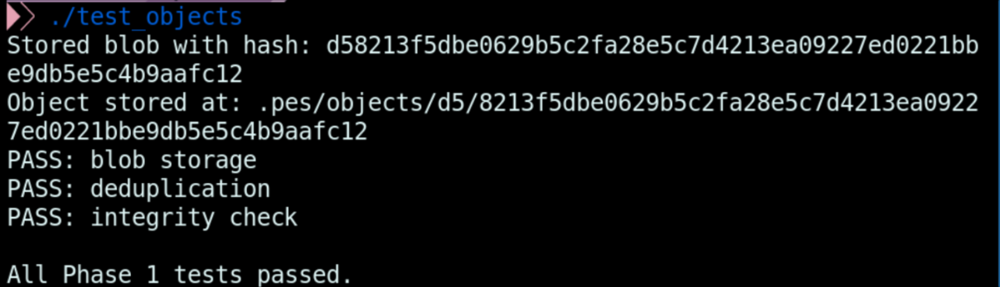

### Screenshot 1B — Sharded object store

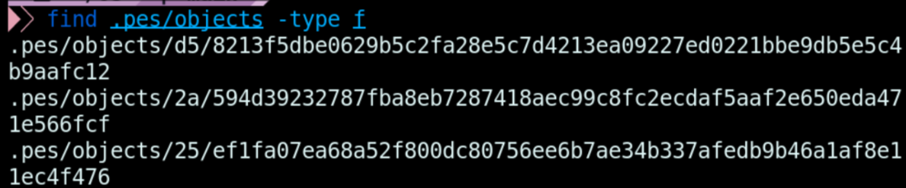

---

## Phase 2: Tree Objects

**Filesystem Concepts:** Directory representation, recursive structures, file modes and permissions

### Implementation Summary

**`tree_from_index`** heap-allocates an `Index`, loads it, sorts entries by path, then calls a recursive helper `write_tree_recursive`. The helper walks the sorted entries: if a path has no `/` relative to the current prefix, it's a direct file entry; if it does, all entries sharing that subdirectory prefix are grouped and the helper recurses to produce a subtree object. Each level serializes its `Tree` struct and writes it to the object store via `object_write`, returning the root tree hash.

### Screenshot 2A — `./test_tree` output

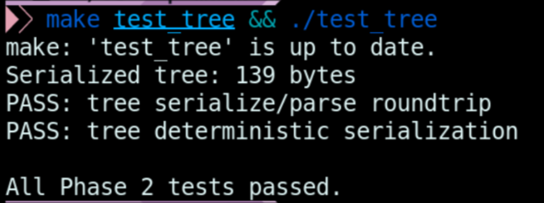

### Screenshot 2B — Raw tree object (xxd)

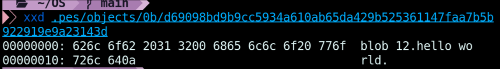

---

## Phase 3: The Index (Staging Area)

**Filesystem Concepts:** File format design, atomic writes, change detection using metadata

### Implementation Summary

**`index_load`** opens `.pes/index` and parses each line with `sscanf` using the format `%o %64s %SCNu64 %SCNu64 %511s` into mode, hex hash, mtime, size, and path fields. If the file does not exist, it returns 0 with an empty index — not an error.

**`index_save`** heap-allocates a sorted copy of the index, sorts entries by path using `qsort`, writes each entry to a temp file using `fprintf` with `PRIu64`/`PRIu32` format specifiers, calls `fflush` + `fsync` + `fclose`, then atomically renames the temp file over the real index file.

**`index_add`** opens the target file, reads its contents, calls `object_write` to store a blob, calls `lstat` to get metadata, then either updates an existing index entry (found via `index_find`) or appends a new one, finally calling `index_save`.

### Screenshot 3A — `pes init` → `pes add` → `pes status`

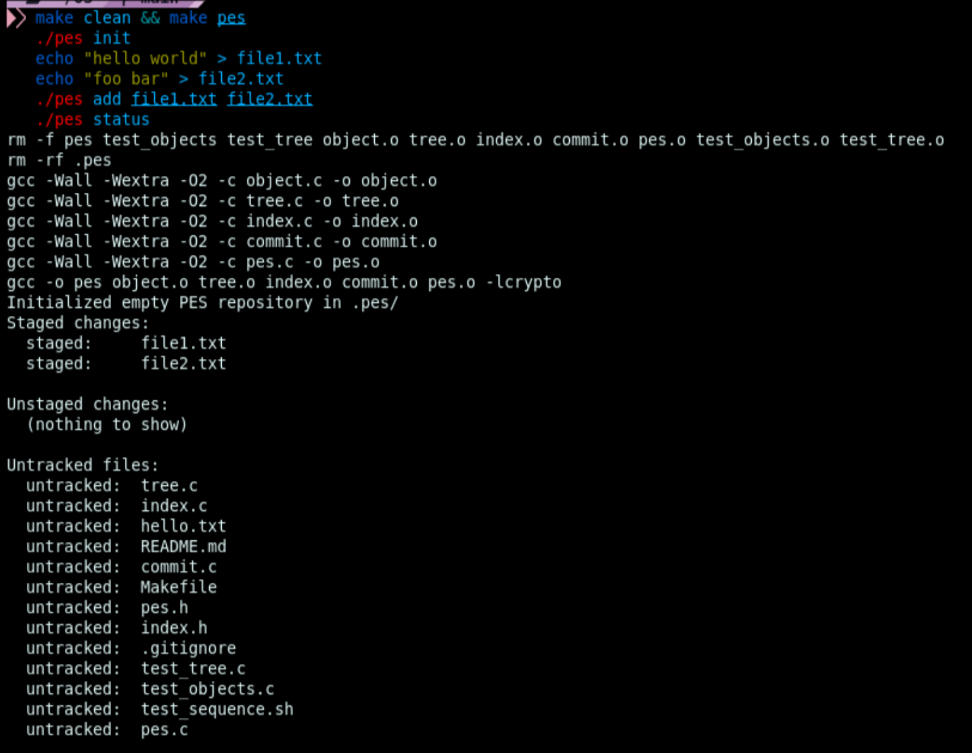

### Screenshot 3B — `cat .pes/index`

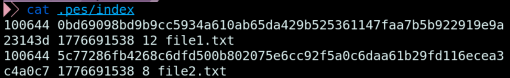

---

## Phase 4: Commits and History

**Filesystem Concepts:** Linked structures on disk, reference files, atomic pointer updates

### Implementation Summary

**`commit_create`** performs the following steps:

1. Calls `tree_from_index` to build and store the directory tree, getting the root tree hash
2. Calls `head_read` to get the parent commit hash — if it fails (first commit), `has_parent` is set to 0
3. Fills the `Commit` struct with the tree hash, optional parent, author string from `pes_author()`, and current Unix timestamp from `time(NULL)`
4. Calls `commit_serialize` to produce the text-format commit buffer
5. Calls `object_write` with `OBJ_COMMIT` to store the commit object
6. Calls `head_update` to atomically move the branch ref to the new commit hash

### Screenshot 4A — `pes log` with three commits

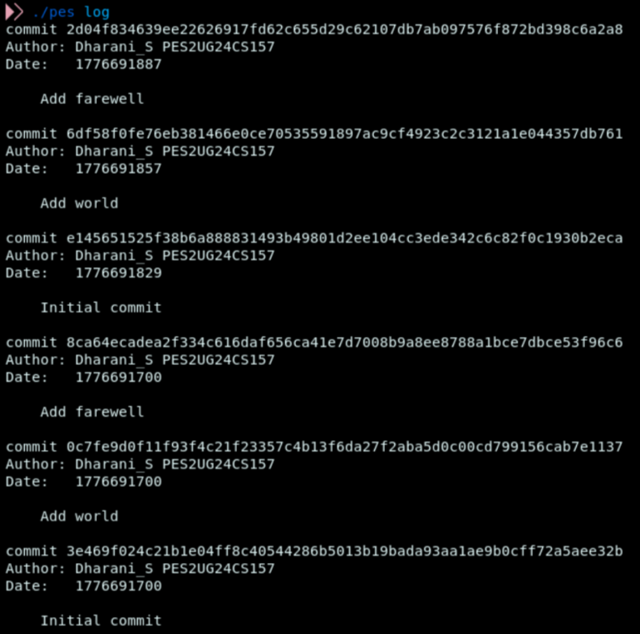

### Screenshot 4B — `find .pes -type f | sort`

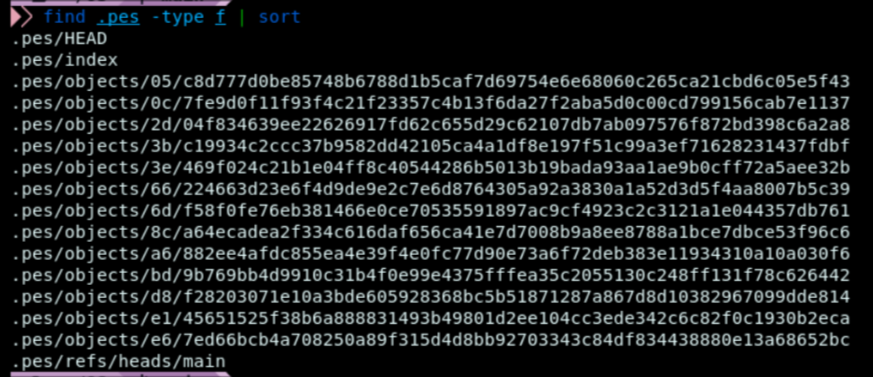

### Screenshot 4C — Reference chain

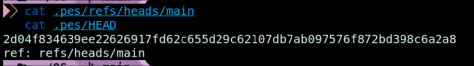

### Final — Integration test

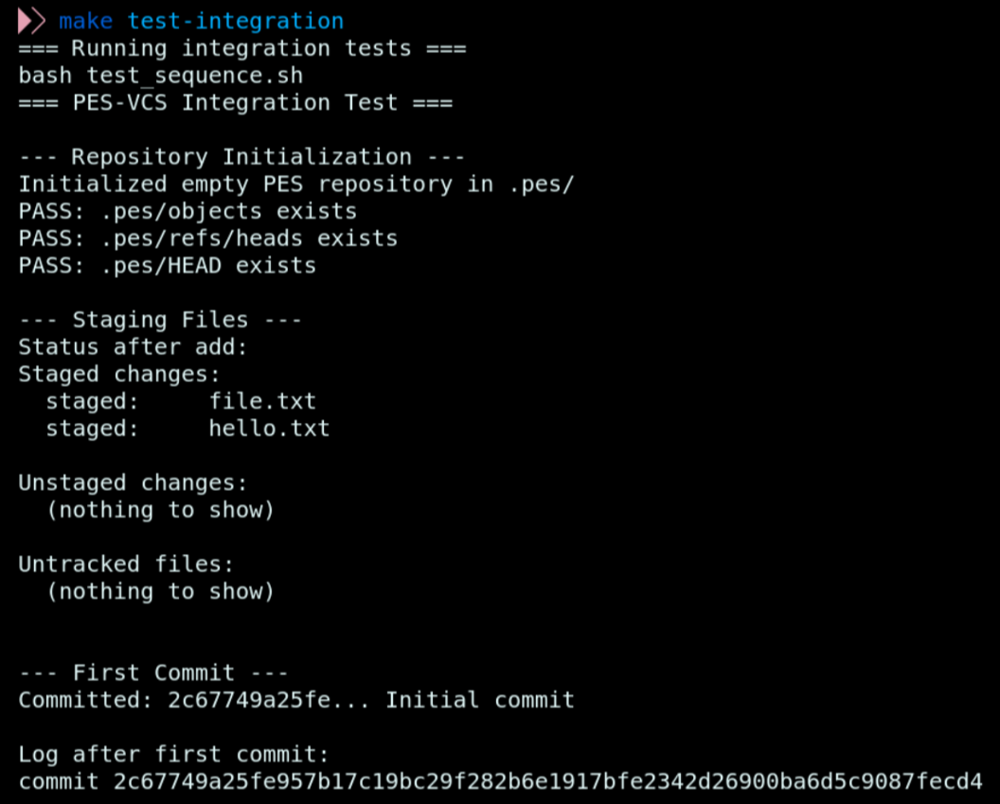
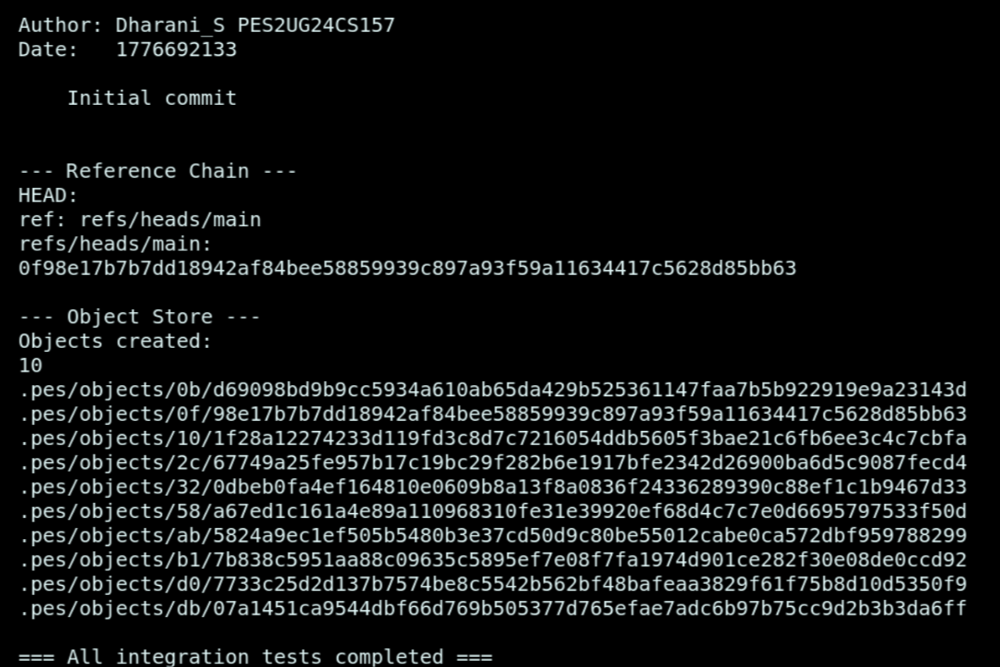
---

## Phase 5: Branching and Checkout (Analysis)

### Q5.1 — Implementing `pes checkout <branch>`

To implement `pes checkout <branch>`, two things must happen in `.pes/`:

1. `HEAD` must be updated to contain `ref: refs/heads/<branch>`
2. If the branch does not exist yet (creating a new branch), a new file must be created at `.pes/refs/heads/<branch>` containing the current commit hash

The working directory must then be updated to match the target branch's tree. This means reading the target commit object, getting its tree hash, recursively walking the tree, and writing each blob's contents back to the corresponding file path — creating subdirectories as needed. Files that exist in the current tree but not the target must be deleted. Files only in the target must be created. Files that differ must be overwritten.

The complexity comes from several sources. First, the working directory update must be atomic enough that a failure midway does not leave the repository in a broken half-switched state. Second, untracked files must not be touched — only tracked files should be updated or removed. Third, nested directory structures require recursive tree walking in both the old and new trees. Fourth, file permissions (executable bit) must be restored correctly from the tree entry modes.

### Q5.2 — Detecting dirty working directory conflicts

For each file that differs between the source and target branch trees, the algorithm is:

1. Look up the file's entry in the current index
2. Call `stat()` on the actual working directory file
3. Compare `stat.st_mtime` and `stat.st_size` against the index entry's `mtime_sec` and `size` fields
4. If they differ, the file has been modified since it was last staged — this is a dirty file
5. If the file exists in the working directory but has no index entry, it is untracked and can be ignored unless the target branch would create a tracked file at the same path, which is also a conflict

If any file that differs between the two branch trees is dirty according to this check, checkout must refuse with an error message listing the conflicting paths. This approach avoids re-hashing file contents by using metadata as a fast proxy for change detection, which is the same technique used by Git's index.

### Q5.3 — Detached HEAD and recovery

In detached HEAD state, `HEAD` contains a raw commit hash instead of a branch reference like `ref: refs/heads/main`. When new commits are made in this state, `head_update` writes the new commit hash directly into `HEAD` rather than updating a branch file. Each new commit correctly points to its parent, forming a valid chain.

However, once the user switches to another branch, `HEAD` is overwritten with the new branch reference. The commits made in detached HEAD state are now unreachable — no branch points to them. They will not appear in `pes log` and will be deleted by garbage collection.

To recover those commits, the user can scan all objects in `.pes/objects/` for commit-type objects, read each one, and identify commits not reachable from any branch ref. Alternatively, if the commit hashes were visible on screen during the session, the user can directly create a new branch pointing at the desired hash:

```bash
echo "<commit-hash>" > .pes/refs/heads/recovery-branch
```

This makes the commit reachable again and restores the full history chain behind it.

---

## Phase 6: Garbage Collection (Analysis)

### Q6.1 — Garbage collection algorithm

The algorithm is a mark-and-sweep over the object graph:

**Mark phase:**
1. Start with every ref in `.pes/refs/` and the commit pointed to by `HEAD`
2. For each reachable commit: mark it, then mark its tree, then recursively mark all blobs and subtrees reachable from that tree, then follow the parent pointer and repeat
3. Use a hash set (implemented as a sorted array of `ObjectID` structs, or a hash table keyed on the 32-byte hash) to track all reachable object hashes

**Sweep phase:**
4. Walk every file under `.pes/objects/` using `find` or `opendir`/`readdir`
5. For each object file, parse its hash from the path
6. If the hash is not in the reachable set, delete the file
7. Remove any empty shard directories

**Estimate for 100,000 commits, 50 branches:**
Assuming an average of 10 files per commit snapshot with heavy sharing between commits (say 3 new blobs per commit on average), the object store contains roughly 100,000 commits + 100,000 trees + 300,000 blobs = ~500,000 objects. The reachability walk visits every reachable object once, so it visits all ~500,000 objects. The sweep also scans all ~500,000 files. Total objects visited: approximately 1,000,000 operations.

### Q6.2 — GC race condition with concurrent commit

The race condition proceeds as follows:

1. GC starts and scans all branch refs, building the reachable set. At this moment, a new blob `B` has just been written to the object store by `pes add`, but no commit references it yet.
2. GC does not find `B` in the reachable set since no commit or tree points to it.
3. GC deletes `B` from the object store.
4. `pes commit` runs, calls `tree_from_index`, builds a tree object that references blob `B`'s hash, and writes the tree. The tree object is stored successfully.
5. `pes commit` writes the commit object pointing to the tree, and calls `head_update`.
6. The repository now contains a commit whose tree references a deleted blob — the object store is corrupt.

Git avoids this race condition using a **grace period**: objects newer than a configurable threshold (default 2 weeks, set by `gc.pruneExpire`) are never deleted by GC regardless of reachability. This gives all in-flight operations more than enough time to complete and add references to new objects before they become eligible for collection. Git's GC also writes a `gc.pid` lock file to prevent two GC processes from running simultaneously.

---

## File Summary

| File | Description |
|------|-------------|
| `object.c` | Content-addressable object store — `object_write`, `object_read` |
| `tree.c` | Tree serialization and recursive construction — `tree_from_index` |
| `index.c` | Staging area — `index_load`, `index_save`, `index_add` |
| `commit.c` | Commit creation and history walking — `commit_create` |
